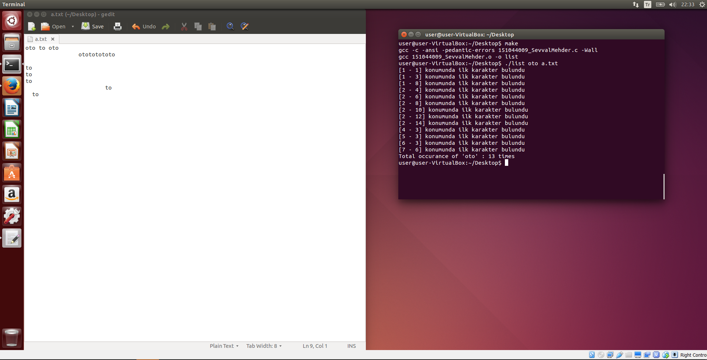
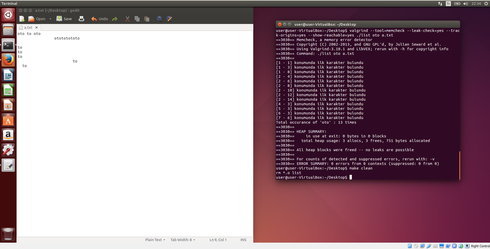

This is a C program that searchs the given string in the given file. And it shows the coordinate of the first letter with line number and column number on the terminal. Use makefile to compile.

## Usage
./list string file  

Note: Program was checked with Valgrind

## Samples

  
  